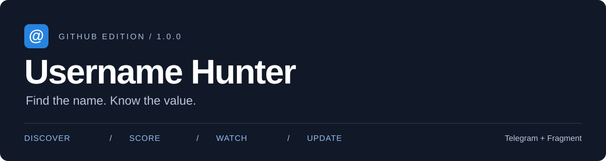
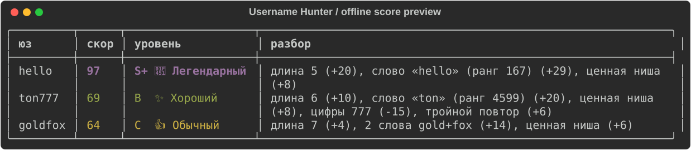

<p align="center">
  
</p>

<p align="center">
  <a href="https://github.com/ggrrrt5543/username-hunter/actions/workflows/ci.yml"></a>
  <a href="https://github.com/ggrrrt5543/username-hunter/releases/latest"></a>
  
  
</p>

<p align="center">
  <b>Находи имена. Оценивай потенциал. Следи за освобождением.</b><br>
  Личный инструмент для поиска Telegram-юзернеймов с удобным терминальным интерфейсом.
</p>

<p align="center">
  <a href="https://github.com/ggrrrt5543/username-hunter/releases/latest/download/username_hunter.zip"></a>
  &nbsp;
  <a href="https://github.com/ggrrrt5543/username-hunter/releases"></a>
</p>

<p align="center">
  <a href="#-быстрый-старт">Установка</a> ·
  <a href="#-что-внутри">Возможности</a> ·
  <a href="#-команды">Команды</a> ·
  <a href="docs/updates.md">Обновления</a> ·
  <a href="CHANGELOG.md">История версий</a> ·
  <a href="https://github.com/ggrrrt5543/username-hunter/issues">Сообщить об ошибке</a>
</p>

---

## ⚡ Быстрый старт

**Нужен Python 3.10+** и интернет для первого запуска. Это Python-программа, не готовый EXE.

1. **[Скачай последний ZIP](https://github.com/ggrrrt5543/username-hunter/releases/latest/download/username_hunter.zip)** и распакуй в обычную папку.
2. **Windows:** двойной клик по `run.bat`.
3. **Linux / macOS:** открой терминал в папке и выполни `sh run.sh`.
4. Программа создаст `.venv`, установит зависимости и откроет меню. Повторный запуск не переустанавливает неизменённые зависимости.

Для более надёжной проверки подключи **свой** Telegram API: меню настройки или `setup`. Ключи получаются на [my.telegram.org](https://my.telegram.org). Номер, код и пароль 2FA вводятся только локально.

> 🟡 «Похоже свободен» — не подтверждённая находка. 🟢 Проверка API отражает состояние на момент запроса и **не резервирует имя**. Перед использованием перепроверь результат.

[Подробная установка и решение проблем →](docs/setup.md)

## ✨ Что внутри

| Возможность | Что делает |
| :--- | :--- |
| **Поиск по твоим правилам** | Длина, буквы, цифры, префиксы, суффиксы, скор, уровень и оценка цены |
| **Генераторы и словари** | Читаемые имена, брендовые варианты, английские слова, русский транслит, пары и ниши |
| **Проверка в несколько этапов** | t.me → Fragment → Telegram API, с отдельными статусами неопределённых результатов |
| **Скоринг 0–100** | Длина, словарность, звучание, повторения и паттерны; уровни от F до S+ |
| **Рынок Fragment** | Лоты, статусы, история продаж и модельная оценка; не обещание дохода |
| **Слежка** | Хорошие занятые имена, периодические проверки, звук и уведомления в «Избранное» |
| **Продолжение перебора** | Прогресс больших шаблонов сохраняется между запусками |
| **Локальная база** | История проверок, находки, список слежки и CSV-экспорт |
| **Понятные обновления** | Последний стабильный релиз, SHA-256, резервная копия кода и сохранение личных данных |

## 🖥 Реальный пример скоринга



Это вывод команды `rate`, **не результаты проверки доступности имён**. Для этой команды сеть и Telegram-аккаунт не нужны.

```bash
python cli.py rate hello goldfox ton777
```

## 🎛 Меню

```text
1  Поиск                    6  Перепроверка жёлтых через API
2  Проверить список         7  Настройки и профили
3  Разобрать один юз        8  Слежка
4  Fragment                 9  Аккаунты Telegram
5  База                     p  Парсинг источников
u  Обновление               d  Диагностика
0  Выход
```

Меню открывается без аргументов. Лучшие готовые находки записываются в `data/ready.txt`.

## ⌨ Команды

Ниже `python cli.py` означает запуск внутри окружения с установленными зависимостями. Можно заменить его на `python bootstrap.py` — запускатель подготовит `.venv` сам. На Linux/macOS используй `python3`, если команда `python` отсутствует.

```bash
python cli.py hunt 5p -n 20 --min 65          # читаемые 5-буквенные
python cli.py hunt ru6 -n 20                 # русский транслит
python cli.py hunt b6 --no-digits --len 5-7   # брендовые имена
python cli.py hunt tonDD                     # шаблон: ton00…ton99
python cli.py check lomak tonix privet       # список имён
python cli.py info durov                     # подробный разбор
python cli.py market --refresh              # обновить рынок
python cli.py db --min 65 --export found.csv # экспорт находок
python cli.py watch add example             # добавить в слежку
python cli.py watch run                     # запустить слежку
python cli.py accounts                      # свои аккаунты
python cli.py presets                       # все генераторы
python cli.py --version                     # версия
python cli.py doctor                        # локальная диагностика
python updater.py --check                   # есть ли новая версия?
python updater.py                           # обновить с подтверждением
```

### Генераторы

| Группа | Пресеты |
| :--- | :--- |
| Буквы и читаемые | `5`, `6`, `5p`, `6p`, `7p`, `5d`, `6d`, `rep` |
| Словари | `w5`–`w8`, `ru5`–`ru7`, `dict` |
| Брендовые и тематические | `b5`, `b6`, `b7`, `niche`, `combo`, `pair`, `mix` |
| Вариации и цепочка | `like:слово`, `all` |
| Источники | `tg:канал`, `url:ссылка`, `file:путь`; `+` в конце добавляет вариации |

Свои шаблоны: **L** — буква, **C** — согласная, **V** — гласная, **D** — цифра, **A** — буква/цифра. Примеры: `CVCVC`, `tonDD`, `xLLLx`.

### Уровни

`S+ ≥ 95` · `S ≥ 85` · `A ≥ 75` · `B ≥ 65` · `C ≥ 50` · `D ≥ 35` · `F < 35`

Скор и уровень — эвристика, не объективная рыночная стоимость.

## 🔄 Обновления без потери данных

Выбери **u** в меню, запусти `update.bat` / `sh update.sh` или `python updater.py`.

- Обновление **только после подтверждения**.
- ZIP сверяется с SHA-256, проверяется состав файлов.
- Заменяемый код копируется в `data/backups/`; обычная ошибка записи вызывает откат.
- `.env`, база, сессии, настройки, прогресс, кэш и пользовательский словарь остаются на месте.
- После обновления перезапусти программу. При изменении зависимостей запускатель установит новую версию требований.

**Закрой другие копии программы перед обновлением.** Резервная копия кода не заменяет отдельный бэкап личных данных. [Подробности и ручное восстановление →](docs/updates.md)

## 🔐 Личные данные остаются локально

В GitHub и ZIP входят **код и встроенные словари**, но не `.env`, SQLite-база, Telegram-сессии, настройки, прогресс или логи. Используются `.gitignore` и сборка по списку разрешённых файлов.

[Правила безопасности →](SECURITY.md)

## 🧪 Тесты и автоматические релизы

GitHub Actions настроен на офлайн-тесты для **Windows, Linux и macOS**, Python **3.10 и 3.13**. Бейдж наверху показывает реальный статус workflow, а не нарисованное «passing».

```bash
python -m unittest discover -s tests -v
python scripts/build_release.py
```

После коммита новой `VERSION` в `main` и успешных тестов Actions автоматически создаёт Release с ZIP и SHA-256. Повторная публикация одной версии пропускается. **Новый код сам не появляется:** его сначала нужно подготовить и отправить в GitHub.

> Тесты не используют настоящий Telegram-аккаунт. Работа внешних сервисов, авторизация и лимиты требуют отдельной проверки в реальной среде.

[Как внести изменения и выпустить версию →](CONTRIBUTING.md)

## ⚠️ Что важно знать

- Telegram может назначить большой `FloodWait`. Программа ждёт и показывает неопределённые результаты жёлтым; это не подтверждение освобождения имени.
- Количество потоков к сайтам не равно допустимой частоте запросов Telegram API.
- VPN/прокси может понадобиться в зависимости от сети. `PROXY` в `.env` относится к Telegram, не к обновлению GitHub.
- Цена Fragment — ориентир по модели/доступным данным; продажа по этой цене не гарантируется.
- Соблюдай условия Telegram и Fragment. Используй только свои аккаунты и разрешённые источники.
- Лицензия на свободное распространение пока не выбрана владельцем; публичный репозиторий не означает автоматическую выдачу таких прав.

---

<p align="center"><b>Username Hunter</b> · Discover / Score / Watch / Update<br>Без магических обещаний. С понятными статусами и твоими данными под контролем.</p>
